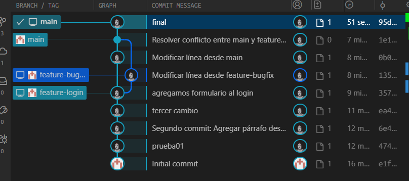

# Práctica de Git – Gestión de Repositorios, Commits, Ramas y Conflictos

Este proyecto contiene el desarrollo completo de las actividades solicitadas en la práctica de Git, que incluye la creación de un repositorio, manejo de commits, trabajo con ramas, merges y resolución de conflictos.

------

## **Actividad 1: Creación de repositorio**

- Se creó un nuevo repositorio en GitHub con un archivo inicial `README.md`.
- El repositorio fue clonado de GitHub al equipo local usando:

```
git clone https://github.com/giancarlovilch/HW007
```

- Se accedió al directorio:

```
cd HW007
```

------

## **Actividad 2: Manejo de commits**

Se creó el archivo `index.html` y se realizaron **al menos 3 commits** agregando contenido progresivamente.

### Cambios realizados:

1. **Primer commit:** creación de `index.html` con un título básico.
2. **Segundo commit:** se agregó un párrafo adicional.
3. **Tercer commit:** se añadió un footer o contenido complementario.

### Comandos utilizados:

```
echo "<h1>Mi primer commit</h1>" > index.html
git add index.html
git commit -m "Primer commit: Crear index.html con título inicial"

echo "<p>Segundo cambio en el archivo index.html</p>" >> index.html
git add index.html
git commit -m "Segundo commit: Agregar párrafo descriptivo"

echo "<footer>Versión 1.0</footer>" >> index.html
git add index.html
git commit -m "Tercer commit: Agregar footer al archivo"
```

Finalmente se subieron los cambios al repositorio remoto:

```
git push origin main
```

------

## **Actividad 3: Branching**

Se trabajó con una rama de desarrollo llamada `feature-login`.

### Pasos realizados:

1. Crear la rama:

```
git checkout -b feature-login
```

1. Realizar cambios dentro de la rama (por ejemplo, agregar contenido relacionado al login en `index.html`).
2. Hacer commit de los cambios.
3. Subir la rama al repositorio remoto:

```
git push origin feature-login
```

1. Volver a la rama principal y hacer el merge:

```
git checkout main
git merge feature-login
git push origin main
```

------

## **Actividad 4: Manejo de conflictos**

Se simuló un conflicto modificando la **misma línea** en ambas ramas: `main` y `feature-bugfix`.

### Pasos realizados:

1. Crear rama para el bugfix:

```
git checkout -b feature-bugfix
```

1. Modificar una misma línea desde esa rama, agregar y hacer commit.
2. Volver a `main`, modificar la misma línea, agregar y hacer commit.
3. Intentar hacer merge (se genera conflicto):

```
git checkout main
git merge feature-bugfix
```

1. Git marca el archivo en conflicto. Se resolvió manualmente editándolo.
2. Se confirmó la resolución del conflicto:

```
git add <archivo_en_conflicto>
git commit -m "Resolver conflicto entre main y feature-bugfix"
```

1. Subir los cambios al repositorio remoto:

```
git push origin main
```

------

